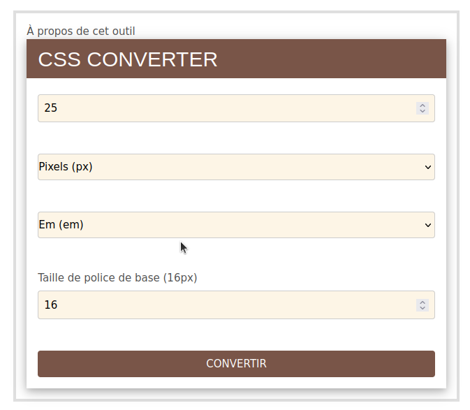
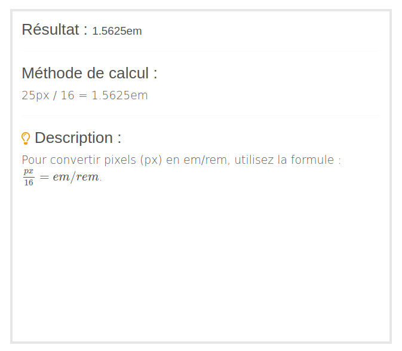

# CSSCONVERTER : CONVERSION D'UNITÉS CSS (PX, EM, REM, %)

### CSSCONVERTER 
Le **cssconverter** est un outil OpenSource en ligne conçu pour faciliter la conversion entre différentes unités de mesure utilisées en CSS (Cascading Style Sheets), telles que les pixels (px), les ems (em), les root ems (rem), et les pourcentages (%). Ces unités jouent un rôle important dans le développement web, permettant aux développeurs et aux designers de définir la taille des polices, les marges, les paddings, les largeurs, et d'autres propriétés de mise en page de manière responsive et accessible.

### FONCTIONNALITÉS PRINCIPALES
- **Conversion entre unités de mesure** : L'outil permet de convertir des valeurs entre les unités `px, em, rem, et %`, offrant une flexibilité essentielle pour le design responsive. Par exemple, il peut convertir une taille de police en pixels en sa valeur équivalente en rem ou em, facilitant ainsi l'adaptation du design à différentes tailles d'écran et préférences utilisateur.

- **Interface utilisateur intuitive** : cssconverter est conçu pour être simple et facile à utiliser, avec une interface claire qui guide l'utilisateur à travers le processus de conversion. Les utilisateurs entrent simplement la valeur à convertir, sélectionnent l'unité source et l'unité cible, et l'outil fournit le résultat.

- **Adaptabilité et accessibilité** : En permettant aux développeurs de facilement passer d'une unité à une autre, l'outil soutient la création de sites web qui s'adaptent mieux à différents dispositifs d'affichage et préférences utilisateur, contribuant ainsi à une meilleure accessibilité web.

- **Éducation et compréhension** : Outre sa fonction principale de conversion, cssconverter peut également servir d'outil éducatif, aidant les utilisateurs à comprendre les relations entre différentes unités CSS et comment elles affectent le rendu d'une page web.

### POURQUOI CONVERTIR LES UNITÉS CSS ?
La conversion des unités CSS est souvent nécessaire pour garantir la cohérence et la flexibilité des mises en page web. Par exemple, les pixels sont souvent utilisés pour définir des tailles fixes, tandis que les ems et les rems sont utilisés pour définir des tailles relatives. Les pourcentages, quant à eux, sont utilisés pour définir des tailles relatives par rapport à un parent. En convertissant ces unités, les développeurs peuvent s'assurer que les éléments de la page s'adaptent correctement à différentes tailles d'écran et à différents contextes de navigation.

### CONTEXTES D'UTILISATION
- **Développement de sites web responsifs** : La conversion entre différentes unités est essentielle dans le cadre du design web responsif, où les éléments de la page doivent s'adapter à différentes tailles d'écran, de la desktop à la tablette et au mobile.

- **Accessibilité** : L'utilisation des unités relatives comme em et rem aide à créer des designs qui s'adaptent aux préférences de taille de police des utilisateurs, améliorant l'accessibilité pour les personnes ayant des besoins visuels spécifiques.

- **Optimisation de workflow** : Pour les développeurs et designers qui passent beaucoup de temps à ajuster les tailles et les espacements, cssconverter offre un moyen rapide et précis de faire ces ajustements sans calculs manuels fastidieux.

### EXEMPLES D'UNITÉS CSS
#### Pixels (px)
- **Définition** : Les pixels sont une unité de mesure fixe qui correspond à un point unique sur un écran.

- **Utilité** : Utilisé pour des dimensions précises et fixes, comme la largeur d'une bordure ou la taille d'un élément.

- **Contexte d'utilisation** : Idéal pour des designs qui nécessitent une précision absolue et où la taille ne doit pas changer en fonction de la taille de police de l'utilisateur ou de la résolution de l'écran.

#### EM
- **Définition** : L'em est une unité de mesure relative qui est basée sur la taille de police de l'élément parent.

- **Utilité** : Permet de créer des mises en page et des typographies scalables qui s'adaptent à la taille de police parente.

- **Contexte d'utilisation** : Utilisé pour le dimensionnement des polices et des espacements dans une conception qui doit s'adapter dynamiquement à la taille de police héritée.

#### REM
- **Définition** : Le rem (Root EM) est basé sur la taille de police de l'élément racine du document (<html>) qui est généralement de 16px par défaut. Cela signifie que 1rem est équivalent à 16px par défaut, mais peut être modifié en modifiant la taille de police de base dans le CSS.

- **Utilité** : Fournit une échelle cohérente pour le dimensionnement des polices et des espacements à travers tout le document.

- **Contexte d'utilisation** : Idéal pour maintenir une cohérence dans la taille des éléments à travers une page ou un site, en s'adaptant à la préférence de taille de police de l'utilisateur.

#### POURCENTAGE (%)
- **Définition** : Le pourcentage est une unité relative qui dépend de la taille de l'élément parent ou d'une autre mesure de référence. Par exemple, 50% signifie la moitié de la taille de l'élément parent.

- **Utilité** : Permet de définir des dimensions qui s'adaptent proportionnellement à la taille d'un autre élément.

- **Contexte d'utilisation** : Utilisé pour des layouts fluides et responsifs, où les éléments doivent s'adapter à la taille de leur conteneur ou à la taille de la fenêtre du navigateur.

Pour utiliser le système de conversion d'unités CSS **`CSSCONVERTER`**, vous devez vous rendre sur le site Web suivant : [https://gnpinformatique.fr/cssconverter/](https://gnpinformatique.fr/cssconverter/).

Sur cette page, vous aurez accès à une interface utilisateur conviviale qui vous permettra de :

Entrer la valeur numérique que vous souhaitez convertir.
Sélectionner l'unité de mesure source (par exemple, px, em, rem, %).
Choisir l'unité de mesure cible dans laquelle vous voulez convertir votre valeur initiale.
(Optionnel) Modifier la taille de police de base (root font size) si vous avez besoin d'une valeur différente du défaut de 16px pour les conversions impliquant rem ou em.
Après avoir soumis ces informations, le site traitera votre demande et affichera le résultat de la conversion, ainsi qu'une description de la méthode de calcul utilisée pour cette conversion. Cela peut être particulièrement utile pour comprendre comment différentes valeurs et unités interagissent dans le contexte du design web.

    
    

### EXEMPLES DE CONVERSION
#### Conversion de pixels (px) en em
Supposons que vous ayez une taille de police de 16px et que vous souhaitiez la convertir en em pour une mise en page responsive. En utilisant cssconverter, vous pouvez entrer la valeur 16 dans le champ de saisie, sélectionner px comme unité source, et em comme unité cible. Après avoir soumis ces informations, le site vous affichera le résultat de la conversion, qui dans ce cas serait 1em. Cela signifie que la taille de police de `16px` est équivalente à `1em` dans le contexte de la mise en page actuelle.

- Calcul : `16px / 16px = 1em`

**NB** : N'oubliez pas que ce genre d'outil est extrêmement utile pour les développeurs et designers web qui cherchent à créer des designs responsifs et accessibles, en leur permettant de facilement ajuster et convertir des tailles à travers différentes unités de mesure CSS.

### CONCLUSION

Le **cssconverter** est un outil précieux pour les développeurs et les designers web, offrant une solution simple et efficace pour la conversion entre différentes unités de mesure CSS. En permettant aux utilisateurs de passer facilement d'une unité à une autre, l'outil favorise la création de designs responsifs et accessibles, tout en offrant une meilleure compréhension des relations entre les différentes unités de mesure CSS. Que ce soit pour ajuster les tailles de police, les marges, les paddings, ou d'autres propriétés de mise en page, cssconverter est un allié précieux pour optimiser le workflow de développement web et garantir une expérience utilisateur de qualité.